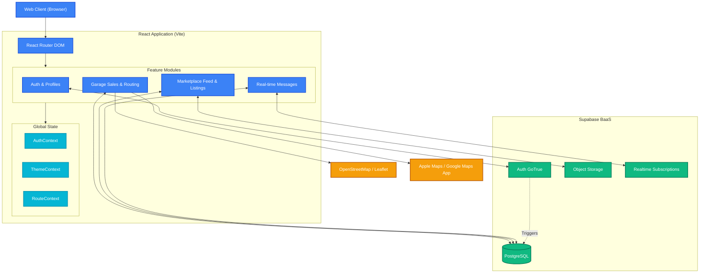
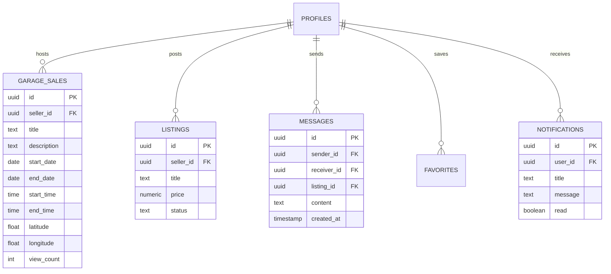

# CulDeSale Architecture Overview

CulDeSale is built on a modern, serverless stack leveraging React for the frontend and Supabase as a Backend-as-a-Service (BaaS). This architecture ensures rapid feature development, robust security via Row Level Security (RLS), and scalable real-time capabilities.

## High-Level System Architecture

The following diagram illustrates the high-level data flow and component relationships:

---

## Database Schema & Relationships

The underlying PostgreSQL database hosted by Supabase uses strict relational integrity and Row Level Security.

---

## Technical Stack Breakdown

### Frontend Layer
- **Framework:** React 18 powered by Vite for lightning-fast HMR and optimized builds.
- **Styling:** TailwindCSS used heavily for utility-first, responsive, and dark-mode compatible UI design.
- **Routing:** `react-router-dom` handles client-side routing and protected route wrappers.
- **State Management:** React Context API is used for global state (Theme, Auth, and the Route Planner).
- **Mapping:** `leaflet` and `react-leaflet` handle interactive map rendering, combined with OpenStreetMap geocoding.

### Backend Layer (Supabase)
- **Database:** PostgreSQL stores all relational data. 
- **Security:** Extensive use of PostgreSQL Row Level Security (RLS) ensures users can only edit/delete their own garage sales and listings.
- **Authentication:** Handled natively by Supabase GoTrue, injecting JWTs seamlessly into database requests.
- **Realtime:** Supabase Realtime channels are utilized for instant chat messaging and notification delivery.
- **Storage:** Supabase Storage buckets handle image uploads for marketplace listings and user avatars.

### Core Feature: Garage Sale Route Planner
The Route Planner operates primarily on the client-side to ensure maximum privacy and offline persistence:
1. **Selection:** Users add sales to `RouteContext`.
2. **Persistence:** The context syncs instantly with the browser's `localStorage`.
3. **Execution:** The `routing.js` utility evaluates the device OS and generates a bulk way-point URL utilizing native schema links (`comgooglemaps://` or `maps.apple.com`), offloading turn-by-turn navigation directly to the user's OS.
